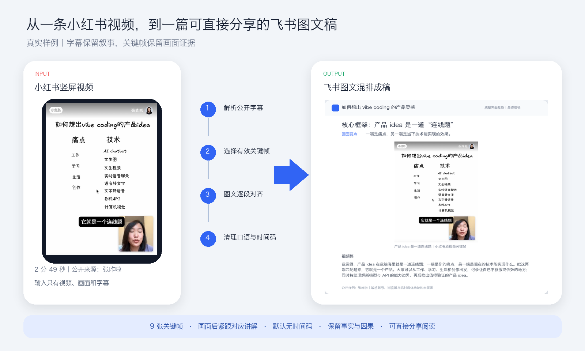
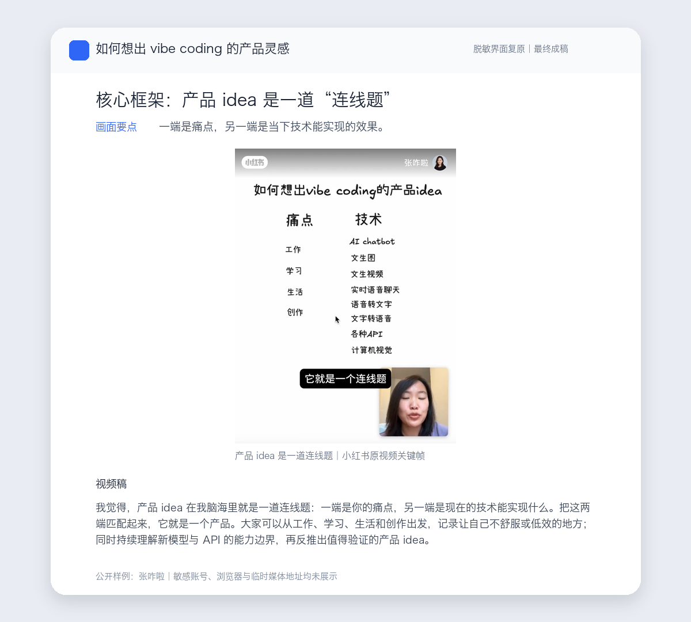

# Creating Illustrated Feishu Doc

> 把视频、妙记、会议纪要、PPT、Deck、字幕和图片，整理成“画面证据 + 对应讲解”的飞书图文文档。

[English](README.md) · [Skill 说明](SKILL.md)



## 一个真实样例

这次输入是一条约 2 分 49 秒的小红书竖屏视频：[《如何想出 vibe coding 的产品 idea》](http://xhslink.cn/o/5KiCbQ9MxCZ)，公开作者为 **张咋啦**。

原始材料只有视频画面、页面字幕和分享短链。Skill 完成了四步：

1. 跟随公开短链重定向，提取标题、作者、字幕与视频信息；
2. 从完整视频中选择 9 张真正推进叙事的关键帧；
3. 将每张画面与正在讲解的字幕段落对齐；
4. 清理口语词、重复片段和时间码，保留观点、例子、技术名词与因果关系。

最终得到一篇标题为《如何想出 vibe coding 的产品灵感｜Zara 风格图文版》的飞书文档：画面后紧跟对应讲解，读者不需要重新观看完整视频也能理解作者的方法。



> 上图根据最终飞书文档的真实标题、正文和关键帧做了脱敏界面复原。账号头像、浏览器标签、桌面内容和临时媒体地址均未进入展示图。

## 它解决什么问题

普通转写会产生一面墙一样的逐句字幕；普通总结又容易丢掉演讲者的推理过程和画面证据。这个 Skill 把两者连起来：

| 原始痛点 | Skill 的处理 | 最终效果 |
| --- | --- | --- |
| 视频很长，读者没有时间重看 | 提取字幕与有效关键帧 | 几分钟扫完核心内容 |
| 画面与讲解分离 | 按时间与语义双重对齐 | 每张图后就是正在讲的那段话 |
| 逐句字幕碎、口语多 | 轻度清理并合并自然段 | 可直接分享，不像机器转写 |
| 普通总结缺少证据 | 保留 Deck、屏幕操作或视频画面 | 观点能回到原始材料核验 |
| 临时媒体地址可能泄露 | 只在内部下载和上传 | 成稿不暴露签名 URL 或 Token |

## 默认成稿结构

```text
主题标题
核心命题 / 阅读导航

章节标题
画面要点
[关键帧 / Deck / 截图]
一整段对应的视频稿

下一章节……
```

默认输出是可读的视频稿，不是原始字幕堆：

- 去掉逐句时间码、时间范围和“插图占位”文字；
- 清理“嗯、啊、诶、那个、然后”等无意义口语词、重复片段和明显识别错误；
- 把相邻字幕合并成自然的一整段；
- 保留事实、数字、名字、技术名词、案例、观点和因果关系；
- 图片说明只描述画面，不暴露临时访问参数；
- 时间码保留在内部，用于图文对齐与最终校验。

如果需要原始逐字稿、字幕、时间轴或按秒对应，明确说“保留时间码”即可切换模式。

## 支持的输入

- 飞书妙记、会议纪要、逐字稿与录音录像；
- 本地或公开可访问的视频、音频；
- PPT/PPTX、飞书幻灯片、HTML Deck、PDF；
- 截图、图片、字幕与纯文本；
- 可公开访问的小红书分享链接，包括 `xhslink.cn` 短链。

## 小红书链接怎么处理

用户不需要手动复制完整长链接。Agent 会对分享短链发起正常 GET 请求并跟随重定向，再从公开笔记页面提取标题、作者、封面、视频和页面字幕。

重定向参数与带签名的临时媒体地址只在内部处理，不写入最终文档，也不依赖无关的第三方下载站。

## 使用示例

```text
用图文混排飞书文档 Skill 处理这条小红书链接。
每张关键画面后接一整段清理过的讲解，不要显示时间码。
```

```text
把这场会议的视频、PPT 和妙记整理成 Zara 风格的飞书图文稿。
保留关键数字、结论与案例，并让每页 Deck 对应它的讲解。
```

## 安装

```bash
git clone https://github.com/liangshimiao2691-wq/creating-illustrated-feishu-doc.git ~/.claude/skills/creating-illustrated-feishu-doc
```

其他 Agent 只要把仓库里的 `SKILL.md`、`references/` 和 `agents/` 放入它的 Skill 目录即可。不同 Agent 的安装目录可能不同。

生成真正的飞书文档，需要宿主 Agent 具备飞书/Lark 文档能力并完成用户授权；没有飞书能力时，可以输出本地 Markdown 或 HTML 版本。

## 核心原则

- 忠于素材，不把图文稿偷换成泛泛总结；
- 先放画面，再放对应讲解；
- 轻度口语清理，不擅自改写观点；
- 时间码留在内部对齐和校验中，默认不展示；
- 不虚构缺失的字幕、页面文字、人物身份或画面含义；
- 保留公开来源，保护临时访问参数。

## License

MIT
